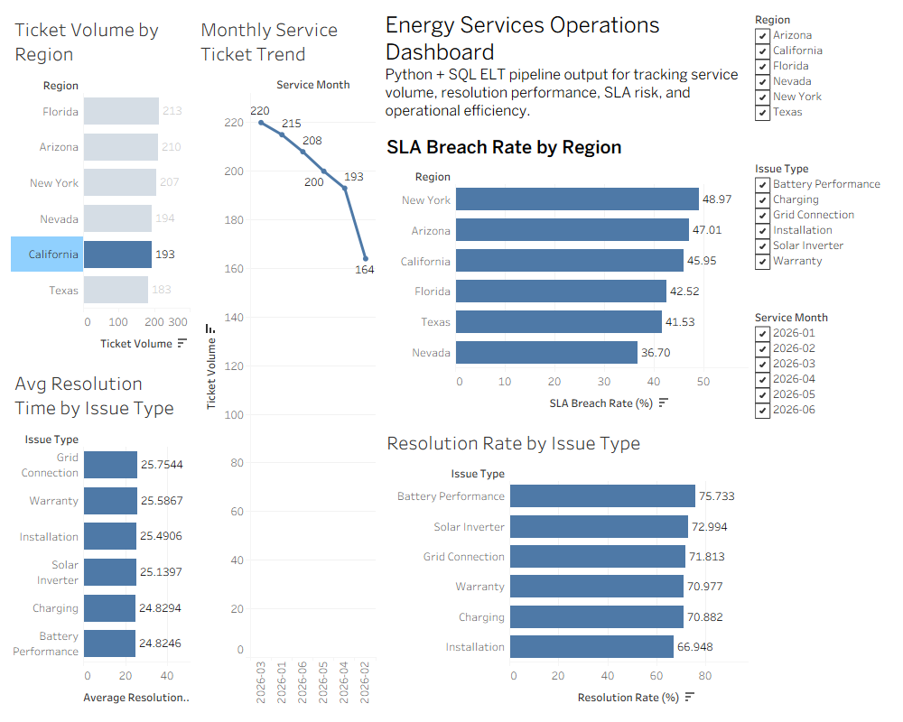

# ⚡ Tesla Energy Services Analytics Pipeline

> End-to-end analytics engineering pipeline for transforming energy service operations data into SQL-based KPI tables and Tableau dashboards using Python, Airflow, SQLite, and Tableau.


---

## 📌 Project Overview

Energy service teams handle large volumes of operational tickets across regions, issue types, technicians, service costs, customer ratings, and resolution timelines.

This project simulates an **Energy Services Transformation & Analytics** workflow by converting raw service operations data into structured KPI outputs and a Tableau dashboard.

The pipeline supports analysis of:

- Service ticket volume
- Regional demand patterns
- Resolution performance
- SLA breach risk
- Issue-level service trends
- Customer rating signals
- Service cost patterns

---

## 🎯 Business Problem

Operations teams need quick visibility into where service delays, SLA risks, and high-volume issues are occurring.

Raw service ticket data is difficult to analyze directly because it must first be cleaned, validated, transformed, and summarized before it can support decision-making.

This project solves that by creating a repeatable analytics pipeline that converts raw service operations data into dashboard-ready insights.

It can support:

- Service operations monitoring
- SLA risk tracking
- Regional performance analysis
- Issue-type prioritization
- Technician performance review
- Stakeholder reporting

---

## 🏗️ Pipeline Architecture

```text
Raw Service Ticket CSV
        ↓
Python ETL Pipeline
        ↓
Cleaned Analytics Dataset
        ↓
SQLite Database
        ↓
SQL KPI Transformations
        ↓
Tableau-Ready CSV
        ↓
Operations Dashboard
```

---

## 📈 Dashboard Preview



---

## 📊 Dataset Scope

| Metric | Value |
|----------|---------|
| Raw Service Records | 1,200 |
| Cleaned Records | 1,200 |
| Regions Analyzed | 6 |
| Issue Types | 6 |
| KPI Summary Rows | 215 |
| Dashboard Views | 5 |
| Database | SQLite |
| BI Tool | Tableau |

---

## 📌 Key Metrics

| KPI | Purpose |
|----------|---------|
| Ticket Volume | Measures service demand by region |
| Average Resolution Time | Tracks operational response efficiency |
| SLA Breach Rate | Identifies service risk areas |
| Resolution Rate | Measures issue closure performance |
| Average Service Cost | Tracks cost patterns |
| Average Customer Rating | Captures service quality trends |

---

## 🧰 Technology Stack

### Languages

- Python
- SQL

### Data Processing

- Pandas
- SQLite
- CSV Processing
- Data Cleaning
- Data Transformation

### Workflow Orchestration

- Apache Airflow
- Airflow DAGs
- Scheduled Pipeline Tasks

### Business Intelligence

- Tableau
- KPI Dashboards
- Operational Analytics
- Stakeholder Reporting

### Tools

- Git
- GitHub
- VS Code

---

## 📁 Repository Structure

```text
tesla-energy-services-analytics-pipeline
│
├── dags/
│   └── tesla_energy_services_elt_dag.py
│
├── data/
│   ├── raw/
│   │   └── service_tickets.csv
│   └── processed/
│       └── service_tickets_clean.csv
│
├── sql/
│   └── transform_service_kpis.sql
│
├── src/
│   ├── etl_pipeline.py
│   └── run_sql_transforms.py
│
├── tableau/
│   ├── dashboard_screenshot.png
│   ├── tesla_energy_services_dashboard_data.csv
│   ├── Energy Services Operations Dashboard.twb
│   ├── Energy Services Operations Dashboard.twbx
│   └── Tableau_Build_Guide.md
│
├── energy_services.db
├── requirements.txt
├── AIRFLOW_DOCKER_NOTE.md
└── README.md
```

---

## ⚙️ How to Run

Install dependencies:

```bash
pip install -r requirements.txt
```

Run the Python ETL pipeline:

```bash
python src/etl_pipeline.py
```

Run SQL transformations and export the Tableau-ready dataset:

```bash
python src/run_sql_transforms.py
```

Final Tableau dataset:

```text
tableau/tesla_energy_services_dashboard_data.csv
```

---

## 🌊 Airflow Workflow

The project includes an Airflow DAG located at:

```text
dags/tesla_energy_services_elt_dag.py
```

The DAG orchestrates:

```text
Python ETL
    ↓
SQL KPI Transformations
    ↓
Tableau Export Validation
```

This demonstrates how the workflow can be scheduled and repeated in a production-style analytics environment.

---

## 📊 Tableau Dashboard

The Tableau dashboard tracks:

- Ticket Volume by Region
- Monthly Service Ticket Trend
- Average Resolution Time by Issue Type
- SLA Breach Rate by Region
- Resolution Rate by Issue Type

The dashboard helps identify:

- Which regions have the highest ticket volume
- Which issue types take longest to resolve
- Where SLA breach risk is highest
- Which issue categories have stronger or weaker resolution rates
- How service ticket demand changes month over month

---

## 🚀 Future Enhancements

- PostgreSQL integration
- Dockerized Airflow deployment
- Automated data quality checks
- Cloud storage integration
- Live dashboard refresh
- Technician-level performance dashboard
- SLA breach alerting system
- Streamlit or Power BI version of dashboard

---

## 👨‍💻 Author

**Tej Harish More**

M.S. Data Science  
Rochester Institute of Technology

GitHub: https://github.com/tej-droid-byte
